# Diagrams

Store diagram source and rendered assets here:

- Mermaid source (`.mmd`)
- Rendered exports (`.svg`)

For most users, diagram rendering is optional. Committed `.svg` files are generated by local development workflow and checked into the repo.

## View on GitHub

Primary source (best for readability/editing):

- `docs/feature_store/diagrams/feature_store_target_model.mmd`

Rendered preview .svg (embedded larger):



Why this repo has Node files for diagrams:

- `package.json`: pins Mermaid CLI version for reproducible rendering.
- `package-lock.json`: locks dependency tree for consistent installs.
- `node_modules/`: local installed packages (ignored by git, not committed).
- `package-lock.json` is auto-generated by `npm install` and is normally not edited manually.

## Optional Commands (Maintainers)

WSL one-time setup:

```bash
sudo apt update && sudo apt install -y nodejs npm
```

Install pinned Mermaid CLI dependency from repo root:

```bash
npm install
```

Render all feature-store diagrams:

```bash
scripts/render_diagrams.sh
```

Requirement: run in repo root after `npm install`.
