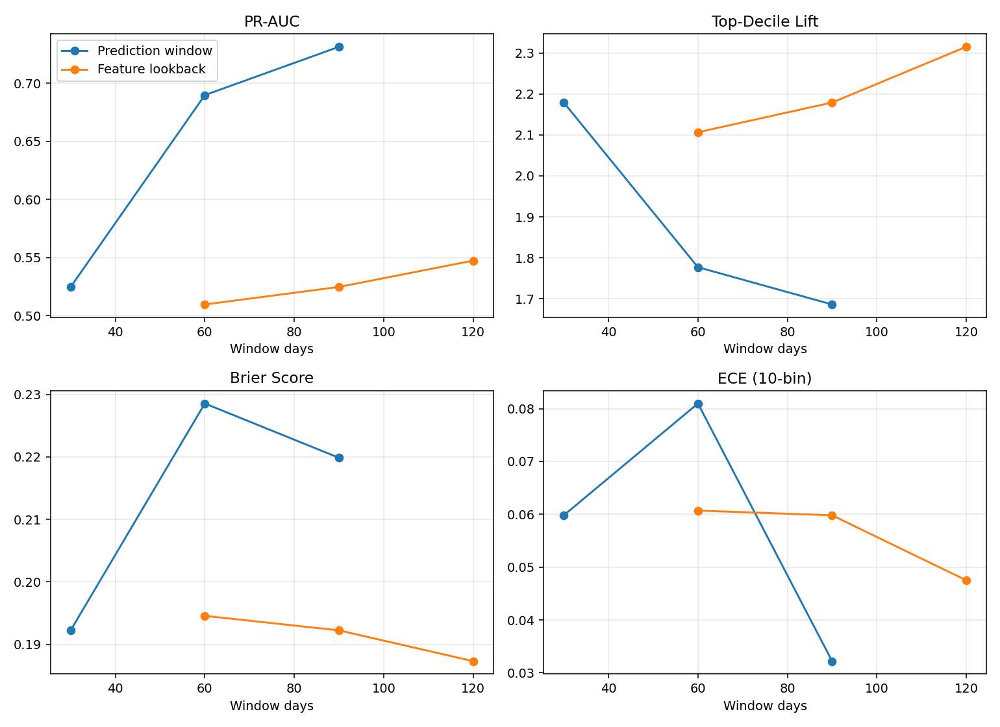
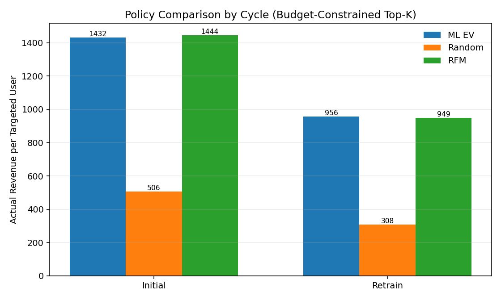

# Purchase Propensity — Analytical Report

## Report Metadata

- **Artifact source:** `artifacts/purchase_propensity/cycle_initial/` and `artifacts/purchase_propensity/cycle_retrain/`
- **Run scope:** two-cycle purchase propensity demo (`cycle_initial` + `cycle_retrain`) from the recommended quickstart flow
- **Update policy:** update this report (or append a new version) after reruns with material result changes

## 1) Executive Summary

**Operational call to action:** deploy ML expected-value targeting as the default candidate for budget-constrained allocation, keep RFM as the live challenger, and treat results as offline evidence (not causal proof).

| Area | Decision | Executive Intuition |
|---|---|---|
| Run health | Proceed | Both cycles passed automated validation checks, so outputs are internally consistent. |
| Policy | Use ML expected-value targeting as default candidate | ML materially outperforms random targeting in revenue per contacted user under the same budget. |
| Benchmark | Keep RFM as active benchmark | RFM remains highly competitive; in this refresh ML trails in cycle 1 but is marginally ahead in cycle 2, so benchmark pressure should remain. |
| Why ML over RFM (for default candidate) | Keep ML as operating default while benchmarking against RFM each cycle | RFM is a strong baseline today, but ML is a better long-term targeting engine: it already beats random by a wide margin, ranks by expected value (`purchase_probability × predicted_revenue`), scales to richer feature space, and supports iterative model tuning while RFM remains the live benchmark guardrail. |
| Structural setup | Freeze `90d` prediction + `120d` lookback + `xgboost` from initial cycle; keep fixed for retrain | Stable structure reduces process complexity and improves comparability across retraining cycles. |
| Scope | Offline policy evaluation only | Results are decision-support signals, not causal incrementality proof. |

## 2) Evaluation Setup

- Run used standard purchase-propensity contract from `docs/purchase_propensity/spec.md` (split/window/policy/selection/artifact checks).
- YAML inputs: `configs/purchase_propensity/cycle_initial.yaml` and `configs/purchase_propensity/cycle_retrain.yaml`.

**Observed run outputs** (artifact-derived, informational):
- `cycle_initial/` and `cycle_retrain/` each group artifacts into `offline_eval/` (strict split predictions + policy outputs) and `report/` (validation summary + interpretation files).
- Serving snapshot scoring writes `prediction_scores.csv` per cycle for operational targeting handoff; policy conclusions below are based on holdout outcomes.
- Cycle mapping used in tables: `Cycle 1 (Initial) = snapshots 2009-12-01 to 2010-11-01`; `Cycle 2 (Retrain) = snapshots 2010-03-01 to 2011-02-01` (quarterly rolling setup with overlapping 12-month windows).

## 3) Window Sensitivity + Freeze Decision (Sensitivity Stage: Train + Validation)

Initial cycle freeze decision:
- selected prediction window: `90d`
- selected feature lookback: `120d`
- selected propensity model: `xgboost`

Sensitivity sweep context (to avoid misread vs Section 4):
- Each candidate combination is trained on train slices and scored on the validation slice.
- Structural freeze is selected from these validation metrics.
- Prediction-window sweep (`30/60/90d`) holds feature lookback at the baseline profile (`90d`).
- Feature-lookback sweep (`60/90/120d`) holds prediction window at the baseline profile (`30d`).
- Section 4 reports the final frozen combo (`90d prediction + 120d lookback`), so exact metric values can differ from sweep rows.

| Cycle | Best prediction window by PR-AUC | PR-AUC |
|---|---|---:|
| Cycle 1 (Initial) | 90d | 0.731326 |

Window outputs:
- `artifacts/purchase_propensity/cycle_initial/offline_eval/window_sensitivity.json`

Retrain cycle uses fixed structural settings from the initial freeze (`window_selection_mode=fixed`), so no structural re-search is required.

## 4) Frozen Model Quality Check (Validation Slice; Drift Signal Monitor)

**Objective:** verify the model has usable ranking and calibration quality before policy comparison.

Section 3 performs structural selection/freeze; this section only verifies the frozen setup quality on validation slices.
Primary quality metric in this section is **PR-AUC**; `ROC-AUC`, top-decile lift, `Brier`, and `ECE` are guardrail metrics.

| Cycle | Frozen model (from Section 3) | PR-AUC | ROC-AUC | Top-decile lift | Brier | ECE |
|---|---|---:|---:|---:|---:|---:|
| Cycle 1 (Initial) | xgboost | 0.75 | 0.71 | 1.75 | 0.22 | 0.03 |
| Cycle 2 (Retrain) | xgboost | 0.66 | 0.77 | 2.52 | 0.20 | 0.15 |

Guardrail interpretation (validation slice):
- `ROC-AUC`: rank-discrimination sanity check (higher is better). Retrain is stronger (`0.77` vs `0.71`).
- `Top-decile lift`: concentration of positives in the top-ranked decile (higher is better). Retrain is stronger (`2.52` vs `1.75`).
- `Brier`: probability error (lower is better). Retrain is slightly better (`0.20` vs `0.22`).
- `ECE`: calibration gap (lower is better). Initial is better-calibrated (`0.03` vs `0.15`), so retrain has a calibration tradeoff despite stronger ranking.

Revenue-model validation quality (buyers only):

| Cycle | RMSE | MAE | MAPE |
|---|---:|---:|---:|
| Cycle 1 (Initial) | 2018.9 | 691.9 | 1.2 |
| Cycle 2 (Retrain) | 2872.6 | 800.8 | 2.7 |

Revenue-model interpretation (validation slice; buyers only):
- `RMSE`/`MAE`: absolute revenue error in currency units (lower is better).
- `MAPE`: relative percentage error vs actual buyer revenue (lower is better; can be unstable when actuals are small).
- In this run, initial cycle has lower error across all three metrics, so retrain-cycle policy gains should be interpreted as driven more by better propensity ranking than better revenue regression fit.

## 5) Policy Comparison Under Budget Constraint (Test Slice)

**Objective:** compare targeting policies on realized **test-slice** holdout outcomes using the same target volume under frozen structural settings from Section 3.
Test-slice policies are evaluated after final refit of the selected ML models on `train+validation`; the test snapshot remains untouched until this holdout scoring step.

**Interpretation:**
- ML targeting clearly beats random baseline in both cycles.
- ML is slightly below RFM in cycle 1 and marginally above RFM in cycle 2 on revenue per targeted user.

Policy rules (applies to both cycles):
- ML expected value: rank by `propensity_score × predicted_conditional_revenue`, target Top-K by budget.
- Random baseline: deterministic random target selection, target Top-K by budget.
- RFM heuristic: rank by recency/frequency/monetary heuristic, target Top-K by budget.
- All three policies are compared on the same test-slice cohort and equal budgeted Top-K, so deltas are apples-to-apples within the holdout slice.
- Refit applies to ML model scoring only; `random` and `rfm` are deterministic ranking baselines computed directly on the same holdout rows.

Revenue per Targeted User (Historical Realized):

| Cycle | ML | Random | RFM | ML vs Random | ML vs RFM |
|---|---:|---:|---:|---:|---:|
| Cycle 1 (Initial) | 1432.0 | 505.8 | 1444.4 | +926.2 | -12.3 |
| Cycle 2 (Retrain) | 956.0 | 307.7 | 949.3 | +648.4 | +6.7 |

Purchase Rate (Historical Realized):

| Cycle | ML | Random | RFM | ML vs Random | ML vs RFM |
|---|---:|---:|---:|---:|---:|
| Cycle 1 (Initial) | 0.68 | 0.41 | 0.70 | +0.27 | -0.01 |
| Cycle 2 (Retrain) | 0.66 | 0.35 | 0.65 | +0.31 | +0.01 |

Policy comparison details are stored in:
- `artifacts/purchase_propensity/cycle_initial/offline_eval/offline_policy_budget_test.json`
- `artifacts/purchase_propensity/cycle_retrain/offline_eval/offline_policy_budget_test.json`

## 6) Post-Freeze Two-Cycle Summary (Validation + Test)

Slice key: this section summarizes post-freeze results; model-quality columns (`ROC-AUC`, `PR-AUC`, `RMSE`, `MAE`, `MAPE`) come from Section 4 validation-slice checks, and policy-delta columns come from Section 5 test-slice backtests.

| Cycle | Score Date | Model | ROC-AUC | PR-AUC | RMSE | MAE | MAPE | ML vs Random (rev/user) | ML vs RFM (rev/user) |
|---|---|---|---:|---:|---:|---:|---:|---:|---:|
| Cycle 1 (Initial) | 2010-11-01 | xgboost | 0.71 | 0.75 | 2018.9 | 691.9 | 1.2 | 926.2 | -12.3 |
| Cycle 2 (Retrain) | 2011-02-01 | xgboost | 0.77 | 0.66 | 2872.6 | 800.8 | 2.7 | 648.4 | 6.7 |

Interpretation notes:
- Ranking discrimination (`ROC-AUC`) and concentration (`Top-decile lift`) are stronger in retrain cycle.
- PR-AUC is materially higher in the initial cycle; keep both metrics in interpretation.
- ML policy beats random baseline in both cycles by large margin.
- ML is slightly below RFM in cycle 1 and marginally above in cycle 2 (effectively near parity across cycles).
- Revenue-regression error is higher in retrain-cycle validation; evaluate alongside policy outcomes when discussing tradeoffs.
