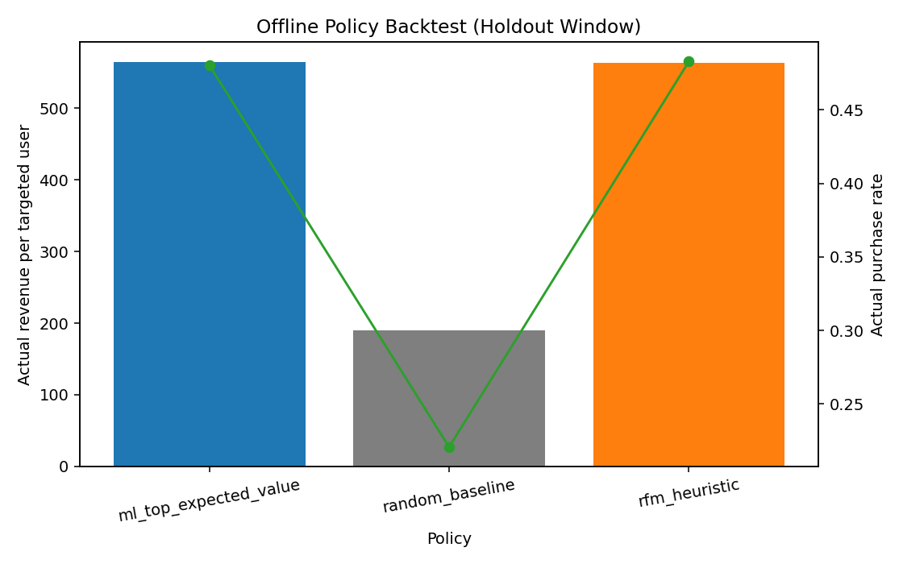
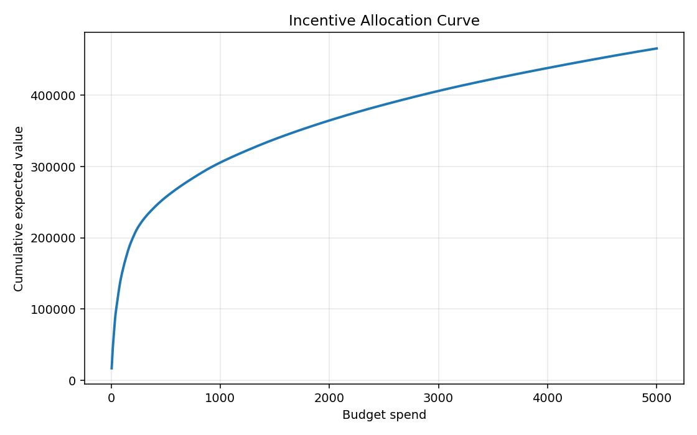
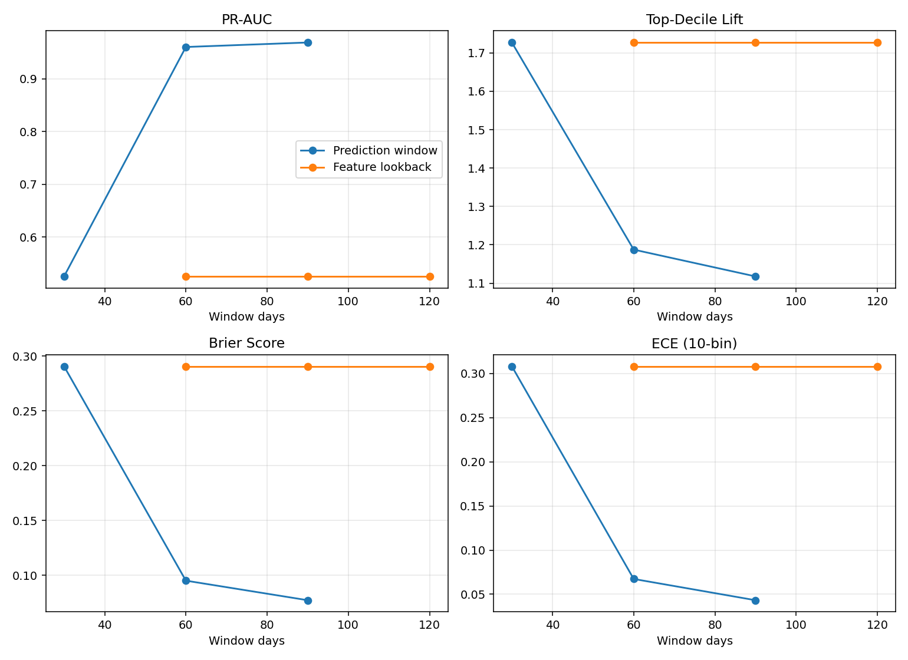

# Purchase Propensity — Analytical Report

_Based on latest local artifacts in `artifacts/purchase_propensity/`._

_Update this report or append new version (not automated) after each recommended quickstart run if there are significant updates._

## 1) Executive Summary

- **Run Health:** out-of-time run passed all automated validation checks.
- **Scope Boundary:** this is offline policy evaluation only; no causal incrementality claim.
- **Decision (Policy):** use ML expected-value targeting as primary versus random baseline.
- **Decision (Benchmark):** keep RFM as benchmark because ML and RFM are close in this run.
- **Decision (Window Default):** keep `30d` target + `90d` lookback as main pipeline default.

## 2) Evaluation Setup

**YAML-configurable knobs** for this run (`configs/purchase_propensity/default_out_of_time.yaml`):
- Validation mode: `out_of_time`
- Validation rate: `0.2`
- Targeting rate (policy backtest): `20%`
- Budget policy assumptions: budget `5000`, cost/user `5`
- Window knobs: `prediction_window_days`, `feature_lookback_days` (defined in YAML)

**Current code-wired constraints** (not fully open yet):
- Main pipeline currently enforces `prediction_window_days=30` and `feature_lookback_days=90` in `src/mle_marketplace_growth/purchase_propensity/run_pipeline.py`.
- Feature-store sensitivity path now materializes and evaluates additional windows; main guardrail is retained for stable default runs.

**Validation slicing note:** this run uses out-of-time monthly slices (latest snapshots held out).  
Method details are defined in `docs/purchase_propensity/spec.md`.

**Observed run outputs** (artifact-derived, informational):
- Holdout dates: `2011-08-09` to `2011-11-09`
- Train rows: `58,465`
- Validation rows: `21,948`

## 3) Model Quality (Holdout)

**Objective:** verify the model has usable ranking and calibration quality before policy comparison.

**Overall interpretation:** Ranking quality and targeting concentration are strong enough for offline policy comparison, and probability calibration is acceptable for planning use.

| Metric | What it measures | Value | Interpretation of result |
|---|---|---:|---|
| ROC-AUC | Ranking discrimination across thresholds | 0.7797 | Good separation between likely buyers and non-buyers. |
| PR-AUC | Precision/recall performance for the positive class | 0.5368 | Reasonable positive-class retrieval quality for purchase prediction. |
| Top-decile lift | Buyer-rate concentration in top 10% vs base rate | 3.0534 | Top-ranked segment is ~3x richer in buyers than average. |
| Brier score | Probability error (lower is better) | 0.1363 | Probability accuracy is acceptable for offline planning use. |
| ECE (10-bin) | Calibration gap between predicted and observed rates | 0.0487 | Calibration error is moderate/low; score probabilities are usable. |

## 4) Policy Backtest Results (Holdout Outcomes)

**Objective:** compare targeting policies on realized holdout outcomes using the same target volume.

**Interpretation:**
- ML targeting clearly beats random targeting in this run.
- ML and RFM are effectively tied on revenue per targeted user, so RFM remains a meaningful benchmark baseline.

| Policy | High-level policy rule | Revenue / targeted user | Purchase rate |
|---|---|---:|---:|
| ML expected value | Rank by `propensity_score × predicted_conditional_revenue_30d`, target top 20% | 564.2209 | 0.4805 |
| Random baseline | Deterministic random target selection at 20% | 190.4353 | 0.2208 |
| RFM heuristic | Rank by recency/frequency/monetary heuristic, target top 20% | 563.1645 | 0.4830 |

- ML vs Random revenue/targeted-user delta: `+373.7856`
- ML vs RFM revenue/targeted-user delta: `+1.0564`

## 5) Budgeted Allocation Planning (Score-Based)

**Objective:** summarize budget-constrained allocation planning for the configured scenario (`budget=5000`, `cost_per_user=5`) under the ML expected-value policy.

**Interpretation:**
- Scope/method definitions for Section 5 are in `docs/purchase_propensity/spec.md` (Budgeted Offline Policy Evaluation).
- The allocation rule fully uses the available budget (`5,000`) with no unspent amount.
- Budget `5,000` is a scenario assumption for comparable policy testing in this run, not an optimized business budget recommendation.
- Primary planning unit here is `expected value per targeted user` (`465.8047`), aligned with the per-user unit used in Section 4.
- `Expected value per dollar` (`93.1609`) remains a secondary efficiency view for budget planning.
- This is a planning estimate from model scores and observed spend proxies, not causal incrementality.

- Targeted users: `1,000`
- Budget spend: `5,000` (unused: `0`)
- Expected value per targeted user: `465.8047`
- Expected value per dollar: `93.1609`

## 6) Window Sensitivity Notes

**Objective:** compare different window options to see which settings are most useful for this model.

**Metric-definition note:** metric meanings and interpretation rules are defined in `docs/purchase_propensity/spec.md`.

**Prediction-window summary (best model per window):**

| Window | Best model | ROC-AUC | PR-AUC | Top-decile lift | Brier | ECE | Gap coverage |
|---|---|---:|---:|---:|---:|---:|---:|
| 30d | xgboost | 0.7527 | 0.4722 | 2.8027 | 0.1314 | 0.0336 | 0.4933 |
| 60d | xgboost | 0.7620 | 0.6350 | 2.1784 | 0.1831 | 0.0385 | 0.7100 |
| 90d | logistic_regression | 0.7791 | 0.7302 | 1.9627 | 0.1980 | 0.0860 | 0.8071 |

**Feature-lookback summary (30d target; best model per lookback):**

| Lookback | Best model | ROC-AUC | PR-AUC | Top-decile lift | Brier | ECE |
|---|---|---:|---:|---:|---:|---:|
| 60d | xgboost | 0.7401 | 0.4329 | 2.5524 | 0.1337 | 0.0270 |
| 90d | xgboost | 0.7527 | 0.4722 | 2.8027 | 0.1314 | 0.0336 |
| 120d | logistic_regression | 0.7600 | 0.4818 | 2.9528 | 0.1300 | 0.0286 |

**Interpretation (concise):**
- Longer prediction windows improve PR-AUC and coverage, but this run trades off calibration quality (`ECE` rises at 90d).
- Longer lookback windows provide a modest model-quality gain versus 90d baseline.
- **Decision (Window Default):** keep `30d` target + `90d` lookback as main default for stable comparisons; use sensitivity evidence to prioritize next controlled trials.

## 7) Optional

1. Add a short “experiment log” section only if tracking repeated model/policy iterations.
