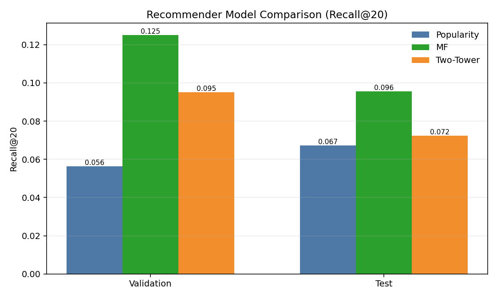

# Recommender — Analytical Report

## Report Metadata

- Artifact source: `artifacts/recommender/`
- Run scope: single-cycle recommender demo from the recommended quickstart flow
- Update policy: update this report (or append a new version) after reruns with material result changes

## 1) Executive Summary

- Run health: all automated validation checks passed.
- Selected model: `mf` (selection rule: maximize validation `Recall@20`).
- Business takeaway: use MF as current retrieval default; keep popularity as baseline and keep two-tower as challenger for future iteration.
- Scope: offline ranking quality only (not causal commercial lift).

## 2) Evaluation Setup

- Pipeline run: `src/mle_marketplace_growth/recommender/run_pipeline.py`
- Retrieval stage: ANN-backed top-K retrieval (`faiss_hnsw_ip`).
- Models compared: `popularity`, `mf`, `two_tower`.
- Baseline hierarchy: Random floor (`K/N`) -> Popularity -> MF -> Two-tower.
- Selection rule from artifacts: `maximize_validation_Recall@20`.
- Metric cutoffs: `K={10,20}`.

From `artifacts/recommender/train_metrics.json`:
- embedding dim: `64`
- epochs: `12`
- learning rate: `0.003`
- negative samples: `8`
- batch size: `4096`
- early-stop metric: `val_recall_at_k` (`K=20`, tolerance `0.0001`, rounds `4`)
- temperature: `0.7`
- normalize embeddings: `true` (cosine-style scoring)
- L2 reg: `0.0001`
- MF components: `64`

Benchmark note:
- `popularity` and `mf` are baseline comparators for sanity-checking retrieval quality.
- In this demo they are not fully tuned via wide hyperparameter search.

## 3) Offline Retrieval Metrics

How to read model comparison:
- All three models are tested on the same users and same split.
- `Recall@20` is the primary selection metric here.
- Higher metric values are better.
- The selected model is the one with highest validation `Recall@20`.

### Validation

| Model | Recall@10 | NDCG@10 | HitRate@10 | Recall@20 | NDCG@20 | HitRate@20 |
|---|---:|---:|---:|---:|---:|---:|
| popularity | 0.036948 | 0.017600 | 0.036948 | 0.056382 | 0.022610 | 0.056382 |
| mf | 0.083013 | 0.044036 | 0.083013 | 0.125000 | 0.054625 | 0.125000 |
| two_tower | 0.065259 | 0.035817 | 0.065259 | 0.095010 | 0.043277 | 0.095010 |

Validation readout (Recall@20):
- `mf` wins (`0.125000`)
- vs `popularity`: `+0.068618`
- vs `two_tower`: `+0.029990`

### Test

| Model | Recall@10 | NDCG@10 | HitRate@10 | Recall@20 | NDCG@20 | HitRate@20 |
|---|---:|---:|---:|---:|---:|---:|
| popularity | 0.049916 | 0.024529 | 0.049916 | 0.067195 | 0.029049 | 0.067195 |
| mf | 0.064795 | 0.033182 | 0.064795 | 0.095512 | 0.040882 | 0.095512 |
| two_tower | 0.045116 | 0.023214 | 0.045116 | 0.072474 | 0.030112 | 0.072474 |

Test readout (Recall@20):
- `mf` remains best (`0.095512`)
- vs `popularity`: `+0.028317`
- vs `two_tower`: `+0.023038`

## 4) Serving Outputs and Artifact Health

Key outputs present:
- `artifacts/recommender/topk_recommendations.csv`
- `artifacts/recommender/model_bundle.pkl`
- `artifacts/recommender/ann_index.bin`
- `artifacts/recommender/ann_index_meta.json`
- `artifacts/recommender/output_validation_summary.json`
- `artifacts/recommender/output_interpretation.md`

Validation summary status:
- overall `passed=true`
- selected model valid and present
- metric bounds checks passed
- recommendation output non-empty
- ANN artifacts present and consistent with selected model

## 5) Decision and Next Run Rule

- Current default candidate: `mf`.
- Keep ranking by offline `Recall@20` for structural model selection consistency.
- Keep quickstart workflow as source-of-truth reproducibility path.
- Two-tower experimentation: model depth was increased experimentally (one hidden layer per tower + ReLU + dropout + L2 normalization), but empirical gains were not sufficient to justify added complexity; keep embedding-only towers as default.

## 6) Plots (Need vs Optional)

- Required for this portfolio demo: none.
- Optional (useful, low-bloat): one model comparison bar chart for `Recall@20` (validation and test) across `popularity`, `mf`, `two_tower`.

